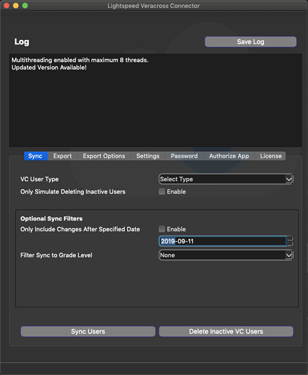
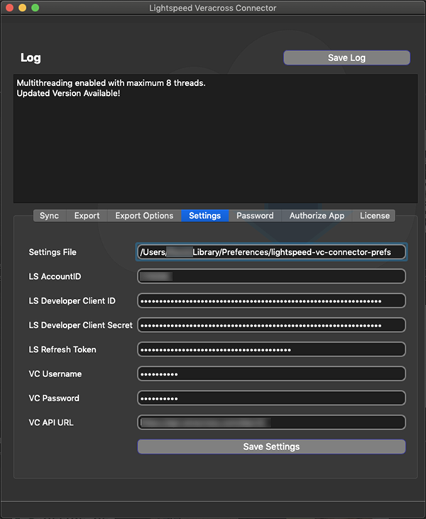
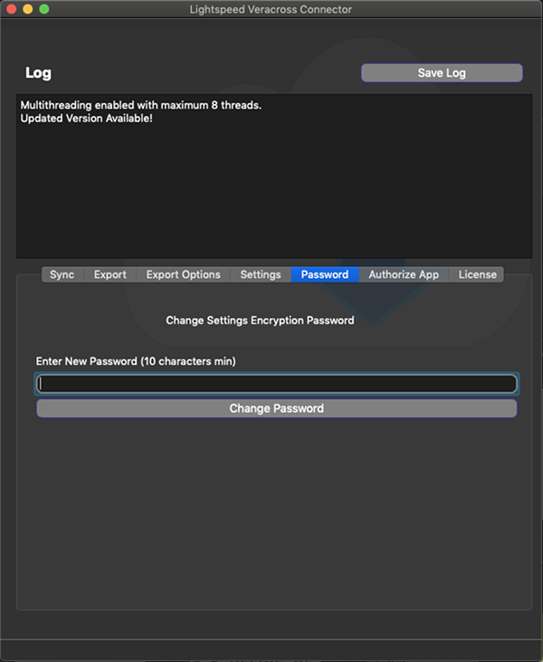
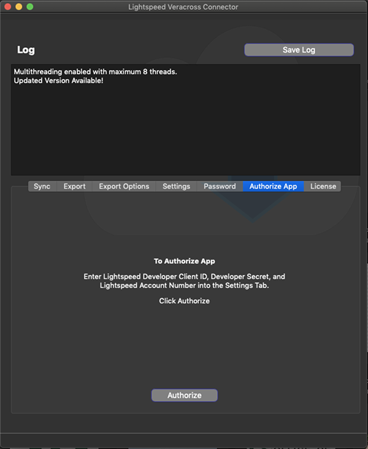

# Veracross and Lightspeed HQ POS Sync Connector

This is a PyQT application developed to provide integration between Veracross and Lightspeed.

Features include:
* Settings are encrypted in AES256-CBC.
* Create and update customers in Lightspeed directly from Veracross API.
* Create and update customers that have been updated in VC after a specific date.
* Create and update customers based on Veracross Grade Level.
* Export charges from Lightspeed in a CSV format that is usable by VC.
* Export charges by individual sale items, or credit balance total.
* Clear charge accounts back to zero by applying an exact credit after exporting.
* Easily authorize the application using your own Lightspeed Developer account and your Lightspeed Retail account.

### Screenshots

### How to Get Started
1) [Signup with Lightspeed OAuth](https://cloud.lightspeedapp.com/oauth/register.php)

2) Obtain Veracross API credentials from VC Account Rep.

3) Run the application.  You will be prompted for a password.  This password will be used for encrypting the settings file.

4) On the settings tab, enter:
* LS Account ID Number (Click Username when logged into Lightspeed)
* LS Developer Client Developer ID
* LS Developer Client Secret
* VC Username
* VC Password

5) Click Save Settings and restart the application.

6) Go to the Authroize Tab and click the Authorize link.  Login to LS using your admin login id and password.

7) Grant your application access to the account.  When granted, if you used localhost as the redirect, you will see an error not found page.  
In the URL copy the token after the equals sign and paste this into the first text box. You must complete the next step within 30 seconds.  

8) Click Authorize.

9) Copy and paste the returned Refresh Token from the Authorize Tab to the settings tab on the LS Refresh Token field.

10) Click Save settings.